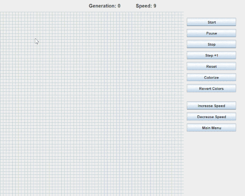

# Conway's Game of Life

A Java Swing implementation of Conway's Game of Life. This application allows users to simulate the cellular automaton with features like starting, pausing, resetting the simulation, stepping forward one generation, and colorizing the cells.

### Gameplay Demo



## Features

- **Start/Pause Simulation:** Begin or pause the automatic progression of generations.
- **Stop Simulation:** Completely stop the simulation and reset the generation count.
- **Step Forward:** Advance the simulation by one generation manually.
- **Reset Board:** Clear the entire board and reset the generation count.
- **Colorize Cells:** Assign random pastel colors to alive cells for better visualization.
- **Adjust Speed:** Increase or decrease the simulation speed.
- **Main Menu:** Navigate back to the main menu.

## Requirements

- **Java Version:** Java 17 or higher
- **Build Tool:** Maven

## Installation

1. **Clone the Repository:**

   ```bash
   git clone https://github.com/dev.stephenpearson/ConwaysGameOfLife.git
   cd ConwaysGameOfLife
